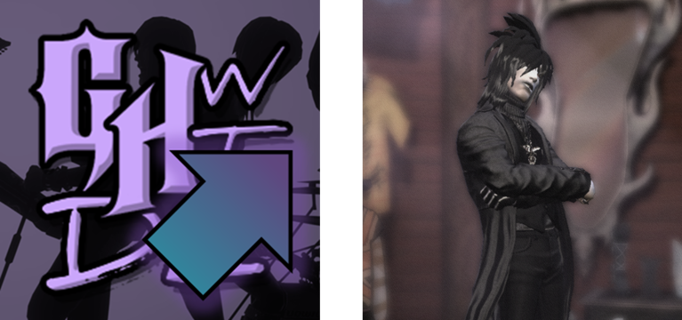

<!--
    GHWT: Definitive Edition Launcher V3 Readme
    Written by IMF24
-->
<!-- - - - - - - - - - - - - - - - - - - - - - - -->
<!-- TOP ICON GROUP -->
<!-- - - - - - - - - - - - - - - - - - - - - - - -->

<!-- - - - - - - - - - - - - - - - - - - - - - - -->
<!-- TOP BANNER -->
<!-- - - - - - - - - - - - - - - - - - - - - - - -->

Whoa, dude, this thing is VERY snazzy!

This is the **new and improved** GitHub repository for my GHWT: Definitive Edition Launcher Version 3!

If you recall the last time we made this thing, we built it in the GameMaker IDE, using the GML scripting language. While that was an easy approach at first, it became evident that this launcher would need to be recreated in a new, more sensible way. It could have been built in Python again, but the executable became quite bloated over its various updates, and we needed something to build this launcher on that would be flexible and scalable as time went on.

So, in light of that, I decided to rebuild this launcher entirely from the ground up, but instead of creating it in GML or Python again, I elected to build it on something new to me: C# (C Sharp) using .NET.

That's right! We've come full circle; we're back to a C#, .NET based launcher, and it will be rebuilt from the ground up *entirely* in C#!

The goal of the V3 launcher is to have all of the functionality and capability of the [V2 launcher](https://github.com/IMF24/WTDE-Launcher), but with a much more visually polished look, much to the style of Uzis's original launcher for WTDE, included back in WTDE update 1.0.3. My V2 launcher replaced it in 1.1, and it has been long overdue for a visual facelift.

Hopefully that covers most of the bases. There'll be more details to come in the future, so stay tuned!

<!-- - - - - - - - - - - - - - - - - - - - - - - -->
<!-- NEW AND RETURNING FEATURES BANNER -->
<!-- - - - - - - - - - - - - - - - - - - - - - - -->

This launcher program is designed to retain every facet of the 2.X launcher seen in GHWT: DE up until release 1.3.0.7 with launcher update 2.2.2, along with some much needed overhauls!

Here's a run-down of some of the **NEW** features of the 3.X launcher:
- The visual interface has been **completely overhauled**! In the V2 launcher, while it was feature-packed, it visually was not that pleasant to look at. Now, in update 3.0 and later, the interface now has a clean, visually polished design for your viewing pleasure!
- All of the features that the 2.X launcher contained have been ported over to the 3.X launcher. This includes settings, managers, and more!
- A few of the editors seen in the 2.X launcher have been upgraded:
  - **Rock Star Creator Character Manager:** Now supports assigning CAR characters into preferred band member slots. No longer do you have to guess their character index!
  - **Duplicate Checksum Manager:** More straightforward design and makes more sense compared to its introduction in version 2.1!
- The **Mod Manager** has been **VASTLY** expanded into so much more than it was before!
  - The Mod Installer now truly supports 7Z and RAR files alongsize ZIP files.
  - You can now view the mods in the mod listing by a certain type. Looking for specific mods? You can use this to help narrow the list down some!
  - There is now a **BRAND NEW** manager for finding your mods in your mods folder by various filters: the **Mod Finder**! Get in-depth and find specific installed mods you need to get ahold of!
  - Another new manager: the **Song and Song Category Manager**! In the abandoned 2.2.3 update of the launcher, there was a work-in-progress manager for song and song category management. In 3.0, this manager has been finished IN FULL and is now completely usable!
  - You can also **create your own gem themes** straight in the launcher via the Mod Manager! As long as you have Node.js and the Guitar Hero SDK installed on your machine, you can utilize this feature. Get creative with your own gem theme colors, and the launcher will automatically write an ROQ script mod and compile it for you through the SDK so that you don't have to do any heavy lifting. Just make the gem theme, compile it, and go!

<!-- - - - - - - - - - - - - - - - - - - - - - - -->
<!-- CREDITS BANNER -->
<!-- - - - - - - - - - - - - - - - - - - - - - - -->

### Main Credits
- Made by [IMF24](https://youtube.com/@IMF24), [Fox](https://youtube.com/@Fox-Judy), [Fretworks](https://gitgud.io/fretworks)
- Original 1.0 WTDE Launcher by [Uzis](https://youtube.com/@ImUzis)
- Built in C# 7.3 in [Visual Studio](https://visualstudio.microsoft.com) on [.NET 4.6.2](https://dot.net)
- Background Image Art by [Fox / FoxInari](https://youtube.com/@Fox-Judy)

### Translation Credits
- English Original Text: IMF24, [Raccoon_333](https://youtube.com/@Raccoon_333)
- Spanish Translations: Yopsito, Raccoon_333

### Notice
[.NET](https://dot.net) developed by [Microsoft](https://microsoft.com) and the [.NET Foundation](https://dotnetfoundation.org).

[GHWT: DE](https://ghwt.de) and Fretworks are not affiliated with Activision, Neversoft, RedOctane, Beenox, or Underground Development in any way, shape, or form.

<u>**GHWT: DE is and always will be a free, non-profit fan-made project.**</u>

------------------------

And always remember: Take a good look around.

...

Those who seek, are destined to find.
